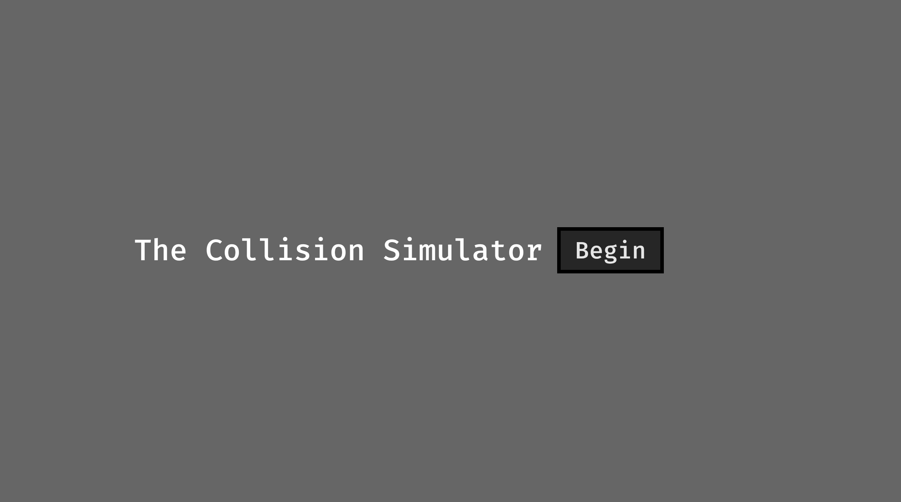
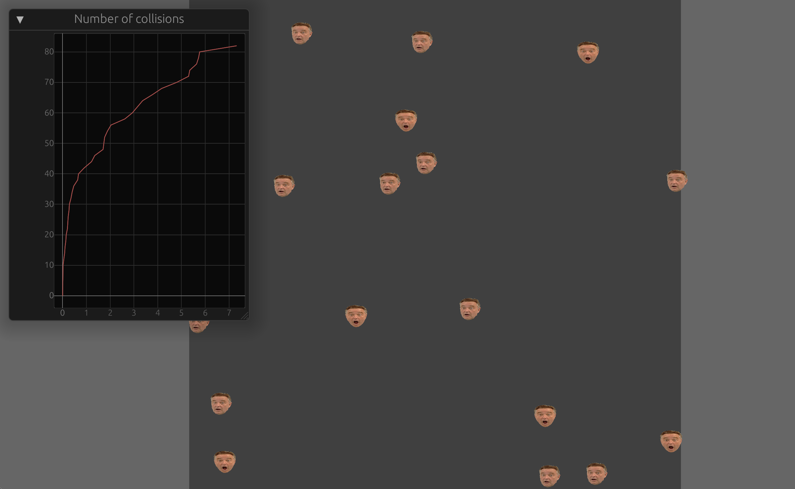
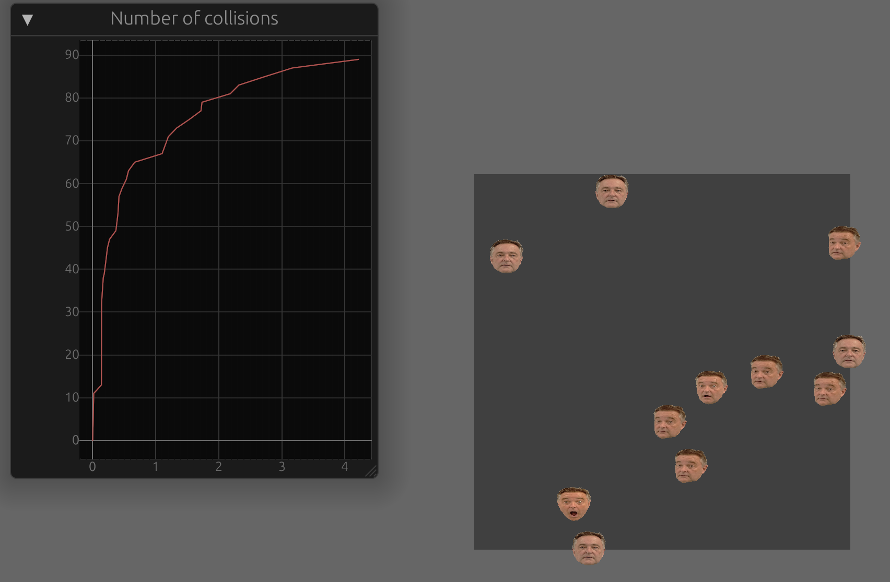

# Collision Simulator

This collision simulator allows the user to experience particle collisions while changing different variable.



The controls menu gives you access to different variables. Currently, the supported variables are:
1. Temperatuure
2. Pressure


If you so please, you can increase or decrease them.

Increasing temperature:


Increasing pressure:


To compile and run the project:
```sh
git clone https://github.com/dworv/collision-sim
cd collision-sim
cargo run
```
